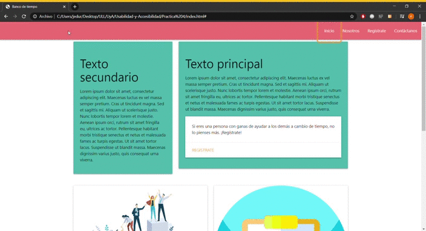
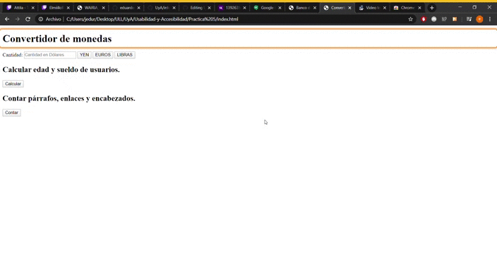

# Informe Ejercicio WAI-ARIA

## Práctica 4
1. **Sin WAI-ARIA**

Se puede observar que sin WAI-ARIA chrome vox recorre a la perfección la barra de navegación y el footer, sin embargo no reconoce el texto de la página ni entra en los elementos de materialize "cards".

2. **Con WAI-ARIA**

Una vez incluidas las etiquetas WAI-ARIA Chrome Vox recorre todos los elemtnos de la página de forma correcta, tanto como el texto de las cartas, como la opción que permite a estas cartas desplegarse.

## Práctica 5
1. **Sin WAI-ARIA**

Se observa que recorre todos los elementos de la página correctamente, menos los textos de la página que se los salta al navegar por teclado.

2. **Con WAI-ARIA**

Una vez incluidas las etiquetas WAI-ARIA conseguimos que pase por todos los textos y los lea.

