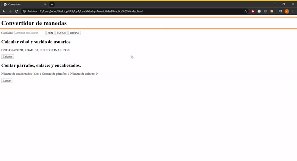

# Informe Ejercicio WAI-ARIA

## Práctica 4
1. **Sin WAI-ARIA**

Se puede observar que sin WAI-ARIA chrome vox recorre a la perfección la barra de navegación y el footer, sin embargo no reconoce el texto de la página.

2. **Con WAI-ARIA**

## Práctica 5
1. **Sin WAI-ARIA**

Se observa que recorre todos los elementos de la página correctamente, menos los textos, sí los títulos aparecen originalmente al cargar la página no lee su contenido mientras que si se generan posteriormente ni siquiera los reconoce.

2. **Con WAI-ARIA**
